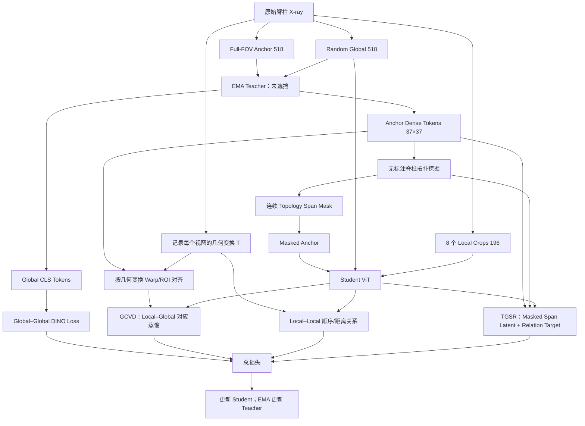

# GeoTopo-DINO：统一模型架构与完整前向过程

> 文档性质：理论设计稿，用于导师讨论。当前没有实验结果，因此所有性能与机制表述均为待验证假设。

## 1. 工作名称与统一研究问题

### 1.1 推荐名称

整个框架暂定为：

**GeoTopo-DINO：Geometry- and Topology-aware DINO for Spine Radiographs**

两个核心组件：

1. **Geometry-Conditioned View Distillation（GCVD）**：几何条件化视图蒸馏。
2. **Topology-Guided Span Reconstruction（TGSR）**：拓扑引导的连续片段重建。

GCVD 比“条件蒸馏”更准确，因为“条件”明确指 crop geometry，而不是类别、文本或人工解剖标签。GCVD 内部包含：

- **Region-Aligned Local Distillation（RALD）**：local 与 global 对应区域对齐；
- **Ordered Local Relation Learning（OLRL）**：建模 local 与 local 的上下、重叠和距离关系。

TGSR 不仅描述“怎样 mask”，还明确描述 mask 后“重建什么”，比单独称为 spine-aware masking 更完整。

### 1.2 一个中心命题

脊柱 X-ray 是一条有序、连续、重复且经常只能被部分观察的解剖链。标准 DINO/iBOT 存在两个互补盲点：

1. 对已经观察到的区域，DINO 将不同 local crops 统一拉向整图语义，可能削弱局部解剖身份；
2. 对被遮挡的区域，iBOT 使用通用 block mask 并独立预测 masked patches，没有显式要求模型理解连续脊柱片段与上下游结构的关系。

因此本文统一解决：

> **如何在部分观察下，同时保留可见局部的几何身份，并利用有序拓扑推断不可见的连续解剖结构？**

两个组件不是并列技巧：GCVD 负责 **observed local anatomy**，TGSR 负责 **missing local anatomy**。

---

## 2. 输入、视图与张量定义

给定一张无标注脊柱 X-ray：

$$
x\in\mathbb R^{H\times W\times 3}.
$$

每张图生成：

- 一个 full-FOV anchor view $g^a$：保留完整可见脊柱，等比例缩放并 padding 到 $518\times518$；
- 一个标准随机 global view $g^r$：继续承担 DINO 的全局语义学习；
- $K=8$ 个 local views $l_1,\ldots,l_K$，输出大小为 $196\times196$；
- 每个 view 对应一个从原图到该 view 的几何变换矩阵 $T_v$；
- anchor padding 对应的 valid mask，防止把 padding 当作解剖区域。

ViT-B/14 下：

| 张量 | 形状 |
|---|---|
| Anchor/global 图像 | $B\times3\times518\times518$ |
| Local 图像 | $8B\times3\times196\times196$ |
| Global patch tokens | $B\times37\times37\times768$ |
| Local patch tokens | $8B\times14\times14\times768$ |
| Local crop 变换 | $8B\times3\times3$ |

采用 full-FOV anchor 的原因不是增加一个大视图，而是确保每个 local crop 在 teacher feature map 中都存在确定的对应位置。若仍使用两个独立 RandomResizedCrop，local 可能根本不包含在任一 global 中。

---

## 3. 整体架构

---

## 4. 模块一：Geometry-Conditioned View Distillation

### 4.1 Teacher 生成空间目标

EMA teacher 接收未遮挡 anchor：

$$
(c_t^a,F_t^a)=f_t(g^a),
$$

其中 $c_t^a$ 是 CLS token，$F_t^a\in\mathbb R^{37\times37\times D}$ 是 dense patch tokens。

Student 接收第 $k$ 个 local crop：

$$
(c_s^k,F_s^k)=f_s(l_k),\qquad F_s^k\in\mathbb R^{14\times14\times D}.
$$

### 4.2 用真实 crop geometry 建立 patch correspondence

对 local patch 网格中的位置 $p_l$：

1. 使用 $T_{l_k}^{-1}$ 映射回原图；
2. 使用 $T_{g^a}$ 映射到 anchor；
3. 除以 patch size 14，得到 teacher feature grid 上的连续坐标；
4. 使用 `grid_sample` 双线性采样 teacher feature。

因此：

$$
\widetilde F_t^k
=\operatorname{Warp}\left(
F_t^a,\,T_{g^a}T_{l_k}^{-1}
\right)
\in\mathbb R^{14\times14\times D}.
$$

该映射必须同时处理 crop、resize、padding 和 horizontal flip；不能只按 bounding box 粗略截取。

### 4.3 Region-Aligned Local Distillation

使用轻量的 student/teacher projection head $h_s,h_t:D\rightarrow256$，而不是将所有 local patches 输入 65,536 维 DINO prototype head，否则显存开销过大。

Dense correspondence loss：

$$
\mathcal L_{\mathrm{dense}}
=\frac{1}{\sum_k|V_k|}
\sum_k\sum_{u\in V_k}
\left[
1-\cos\left(
h_s(F_s^k[u]),
\operatorname{sg}\left[h_t(\widetilde F_t^k[u])\right]
\right)
\right],
$$

其中 $V_k$ 排除 padding 和超出 anchor 的位置。

再对对应区域做一次 pooled region distillation：

$$
r_s^k=\operatorname{Pool}(F_s^k),\qquad
r_t^k=\operatorname{Pool}(\widetilde F_t^k),
$$

$$
\mathcal L_{\mathrm{region}}
=\frac1K\sum_k
\left[1-\cos\left(h_s(r_s^k),\operatorname{sg}[h_t(r_t^k)]\right)\right].
$$

于是 local 不再预测整幅 global CLS，而是预测其在全局上下文中的对应区域。

### 4.4 Ordered Local Relation Learning

仅做 local→global 对齐仍没有显式回答 local→local 的关系。对同一图像中的 local pair $(l_i,l_j)$，从 crop geometry 自动获得：

- superior / overlapping / inferior；
- 归一化中心距离；
- IoU 与尺度比。

模型不接收 crop 坐标作为输入，只将两个 local embeddings 输入 pair head：

$$
q_{ij}=h_{\mathrm{pair}}
\left([r_i,r_j,r_i-r_j,r_i\odot r_j]\right).
$$

最小可靠版本只预测：

1. 三分类方向标签 $y_{ij}\in\{\text{superior, overlap, inferior}\}$；
2. 局部距离排序：若 $d(i,j)<d(i,k)$，则 $l_j$ 应比 $l_k$ 更接近 $l_i$。

$$
\mathcal L_{\mathrm{ord}}
=\mathcal L_{\mathrm{dir}}
+\beta\mathcal L_{\mathrm{rank}}.
$$

不要直接回归绝对 $y$ 坐标，也不要把绝对坐标喂给网络，否则容易学到拍摄 framing shortcut。

### 4.5 GCVD 的完整损失

$$
\mathcal L_{\mathrm{GCVD}}
=\mathcal L_{\mathrm{dense}}
+\lambda_r\mathcal L_{\mathrm{region}}
+\lambda_o\mathcal L_{\mathrm{ord}}.
$$

推荐在主版本中取消标准 DINO 的 local→whole-global CLS loss，仅保留 global→global DINO；否则旧目标仍会把所有 local crops 拉向统一整图语义，与 GCVD 的动机冲突。保留旧 local loss 可作为消融。

---

## 5. 模块二：Topology-Guided Span Reconstruction

### 5.1 为什么 mask 必须在 teacher forward 之后生成

当前 DINOv2 在 DataLoader 的 collate 阶段生成 block mask，此时 teacher 尚未看到图像。若 mask 依赖 teacher 的 spine response，就必须调整顺序：

$$
\text{Teacher unmasked forward}
\rightarrow\text{Topology mining}
\rightarrow\text{Mask generation}
\rightarrow\text{Student masked forward}.
$$

这不是实现细节，而是 TGSR 前向过程的必要依赖。

### 5.2 从 teacher dense tokens 挖掘无标注脊柱拓扑

从 detached teacher tokens 构造 soft response map：

$$
A_{yx}=\operatorname{ReLU}
\left(
\cos(F_t^a[y,x],c_t^a)
\right).
$$

对 $A$ 做平滑并排除 padding。随后寻找一条从 superior 到 inferior 的连续路径：

$$
\mathcal C^*
=\arg\max_{\{x_y\}}
\sum_y A_{y,x_y}
-\lambda_c\sum_y|x_y-x_{y-1}|.
$$

该路径可用动态规划求解，不需要反向传播。再以中心线为中心扩展一个宽度为 $w$ 的 band，形成候选 spine region。

沿中心线弧长将区域划分为 $K_p=6\sim8$ 个宏观有序部分：

$$
S_1\prec S_2\prec\cdots\prec S_{K_p}.
$$

这些部分不是伪造的 C1、T1 或 L1 标签，只表示从头侧到尾侧的相对顺序。

### 5.3 连续 span mask

随机选择起点 $a$ 和长度 $m$：

$$
M_{\mathrm{span}}=S_a\cup S_{a+1}\cup\cdots\cup S_{a+m-1}.
$$

若连续 span 未达到目标 mask ratio，可在 spine band 外补充标准 block mask；若 teacher topology 置信度过低，则整张图回退到标准 block mask。

训练早期 teacher 不可靠，因此使用课程式混合：

$$
p_{\mathrm{topo}}(t):0\rightarrow p_{\max},
$$

即 warm-up 使用 random/block mask，随后逐渐增加 topology span mask 的概率。不要从第一个 iteration 就完全相信 teacher topology。

### 5.4 重建目标一：masked patch latent target

保留 iBOT 的 teacher latent prediction，但将随机 block mask 替换为混合后的 topology mask：

$$
\mathcal L_{\mathrm{iBOT}}^{\mathrm{span}}
=H\left(
q_t(F_t^a[M]),
p_s(F_s^{a,M}[M])
\right).
$$

这里 teacher 看未遮挡 anchor，student 在 patch embedding 后用 mask token 替换 $M$ 内的输入 patches。

### 5.5 重建目标二：masked span 与可见部分的拓扑关系

对每个有序部分做 teacher/student pooling：

$$
u_t^k=\operatorname{Pool}(F_t^a[S_k]),\qquad
u_s^k=\operatorname{Pool}(F_s^{a,M}[S_k]).
$$

构建 part relation matrix：

$$
R_t(i,j)=\cos(u_t^i,u_t^j),\qquad
R_s(i,j)=\cos(u_s^i,u_s^j).
$$

只约束 masked parts 到 visible parts 的关系：

$$
\mathcal L_{\mathrm{topo-rel}}
=\frac{1}{|M_p||V_p|}
\sum_{i\in M_p}\sum_{j\in V_p}
\left|R_s(i,j)-\operatorname{sg}[R_t(i,j)]\right|.
$$

TGSR 的完整目标：

$$
\mathcal L_{\mathrm{TGSR}}
=\mathcal L_{\mathrm{iBOT}}^{\mathrm{span}}
+\lambda_t\mathcal L_{\mathrm{topo-rel}}.
$$

这样第二个创新不再只是“换一种 mask”，而是：

> 删除一个连续拓扑子链，并要求 student 同时恢复其 latent content 以及它与上下游可见结构的组织关系。

---

## 6. 一次训练迭代的完整前向过程

### Step 1：生成视图与几何元数据

DataLoader 输出 anchor、random global、local crops、每个 view 的 $T_v$ 和 valid mask。此阶段不生成 teacher-guided mask。

### Step 2：EMA teacher 看未遮挡 global views

Teacher 输出两个 global CLS，以及 anchor 的 dense patch map $F_t^a$。所有 teacher 输出均 `stop_gradient`。

### Step 3：在线生成 topology span mask

根据 $F_t^a$ 提取 response、centerline、有序 parts 和连续 span mask。低置信样本回退到标准 block mask。

### Step 4：Student 前向

Student 同时处理：

- topology-masked anchor；
- random global；
- 8 个 unmasked local crops。

得到 global CLS、masked global patch tokens、local CLS 和 local patch tokens。

### Step 5：计算 global semantic loss

仅对两个 global views 使用标准 cross-view DINO loss，维持图像级语义稳定性。

### Step 6：计算 GCVD

将 teacher anchor dense map warp 到每个 local 网格，与 student local patches 做对应蒸馏；再由 local pairs 预测上下顺序和局部距离排序。

### Step 7：计算 TGSR

在 topology-masked patches 上计算 iBOT latent prediction，并恢复 masked span 与 visible parts 的 relation matrix。

### Step 8：反向传播与 EMA 更新

总损失只更新 student；随后按 DINOv2 原有 momentum schedule 更新 teacher。

---

## 7. 总目标

推荐的主模型目标为：

$$
\boxed{
\mathcal L
=\mathcal L_{\mathrm{DINO}}^{G\leftrightarrow G}
+\lambda_g\mathcal L_{\mathrm{GCVD}}
+\lambda_m\mathcal L_{\mathrm{TGSR}}
+\lambda_k\mathcal L_{\mathrm{KoLeo}}
}
$$

该式只有两个新增概念：

- GCVD：可见局部的对应与关系；
- TGSR：不可见连续片段的内容与拓扑关系。

不建议首版同时加入 RGB-MAE、HOG、frequency、AP/LAT optimal transport 和 curvature decoder。它们会让主线变成 loss soup。

---

## 8. 最小实现版与完整投稿版

### 最小实现版（先验证核心假设）

1. Full-FOV anchor + 1 random global + 8 locals；
2. global-global DINO；
3. local-global dense/region correspondence；
4. vertical span mask，不依赖复杂中心线；
5. span-iBOT；
6. 不做 local-local relation 和 topology relation reconstruction。

### 完整投稿版

1. GCVD：dense + region + ordered local relation；
2. teacher-derived curved topology；
3. topology span iBOT；
4. masked-to-visible relation reconstruction；
5. confidence fallback 和 warm-up curriculum。

先让最小版证明方向有效，再逐项升级。完整版本并不要求所有组件都保留：任何没有独立增益的子项都应删除。

---

## 9. 当前最关键的未验证假设

| 假设 | 必须怎样证明 |
|---|---|
| 标准 local→whole-global loss 弱化局部身份 | 不同椎体/不同纵向位置的相似度、检索和线性探针 |
| 对应区域蒸馏优于整图蒸馏 | whole-global、ROI pooling、dense warp 三者公平对比 |
| local-local 顺序不是坐标 shortcut | 不输入坐标、shuffle 标签、variable-FOV、跨患者验证 |
| teacher 能稳定发现脊柱链 | 与人工 ROI/关键点在验证集上的 centerline coverage；报告失败率 |
| contiguous span 确实需要长程上下文 | random/block/vertical span/curved span 同 mask ratio 对比 |
| relation reconstruction 有独立价值 | 只换 mask 与再加 relation target 的分离消融 |

如果第一个假设不成立，标题中的 “When Invariance Erases Anatomy” 就不能作为已证实结论，只能改为问题式或更保守的 partial-view topology framing。

