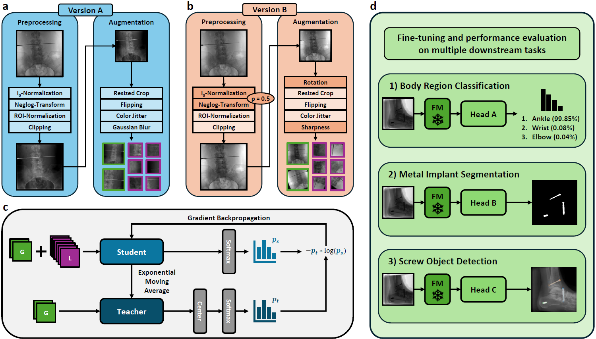
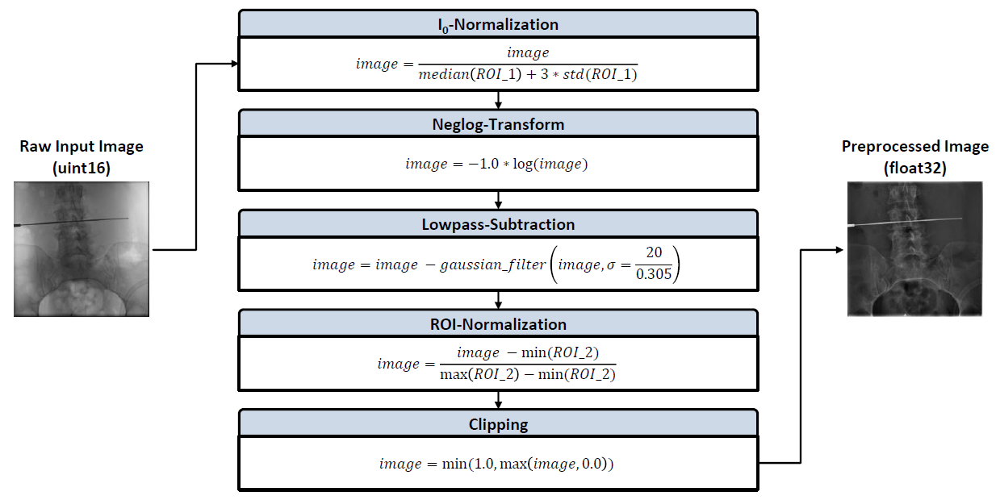

# DINO Adapted to X-Ray (DAX)
In this repository, we provide the official implementation of "DINO Adapted to X-ray (DAX)", a novel framework that specifically adapts [DINO](https://github.com/facebookresearch/dino) for training foundational feature extraction backbones tailored to intraoperative X-ray imaging in orthopedic procedures. In addition, model checkpoints that were pretrained on a novel dataset comprising over 632,000 image samples are made available as well.

## Method


## Checkpoints

| Model                | # Parameters  | Download                           |
|----------------------|--------------:|:----------------------------------:|
| DAX-ResNet18-vA      | 11.2 M        | [Checkpoint](https://huggingface.co/joshua-scheuplein/DAX-ResNet18-A/resolve/main/dax-checkpoint-resnet18-version-a.pth) |
| DAX-ResNet50-vA      | 23.5 M        | [Checkpoint](https://huggingface.co/joshua-scheuplein/DAX-ResNet50-A/resolve/main/dax-checkpoint-resnet50-version-a.pth) |
| DAX-ResNet50-vB      | 23.5 M        | [Checkpoint](https://huggingface.co/joshua-scheuplein/DAX-ResNet50-B/resolve/main/dax-checkpoint-resnet50-version-b.pth) |
| DAX-ViT-T-16-vA      | 5.5 M         | [Checkpoint](https://huggingface.co/joshua-scheuplein/DAX-ViT-T-16-A/resolve/main/dax-checkpoint-vit-t-16-version-a.pth) |
| DAX-ViT-T-8-vA       | 5.5 M         | [Checkpoint](https://huggingface.co/joshua-scheuplein/DAX-ViT-T-8-A/resolve/main/dax-checkpoint-vit-t-8-version-a.pth)   |
| DAX-ViT-S-16-vA      | 21.7 M        | [Checkpoint](https://huggingface.co/joshua-scheuplein/DAX-ViT-S-16-A/resolve/main/dax-checkpoint-vit-s-16-version-a.pth) |
| DAX-ViT-S-16-vB      | 21.7 M        | [Checkpoint](https://huggingface.co/joshua-scheuplein/DAX-ViT-S-16-B/resolve/main/dax-checkpoint-vit-s-16-version-b.pth) |
| DAX-ViT-S-8-vA       | 21.7 M        | [Checkpoint](https://huggingface.co/joshua-scheuplein/DAX-ViT-S-8-A/resolve/main/dax-checkpoint-vit-s-8-version-a.pth)   |

## Training
To start a new model pretraining using DAX (e.g., for a ResNet50 backbone), execute the following command:
```bash
torchrun --nproc_per_node=4 main_dax_training.py --arch='resnet50' --norm_last_layer=True --use_bn_in_head=True --use_fp16=False --clip_grad=0 --global_crops_scale 0.14 1.0 --local_crops_scale 0.05 0.14 --local_crops_number=6 --dataset='DAX-Dataset-{version}' --data_path='path/to/dataset' --augmentation='v2' --output_dir='path/to/output/directory' --num_workers=10 --seed=0 --weight_decay=1e-6 --weight_decay_end=1e-6 --batch_size_per_gpu=128 --epochs=200 --freeze_last_layer=1 --saveckp_freq=1 --warmup_teacher_temp=0.04 --teacher_temp=0.07 --warmup_teacher_temp_epochs=25 --lr=0.3 --warmup_epochs=10 --min_lr=0.0048 --optimizer='lars' --momentum_teacher=0.996 --out_dim=60000 --job_ID='DAX_Training_Job_xxx' --use_wandb='False' --pretrained_weights='path/to/checkpoint' --subtract_lowpass='False' --azure='True'
```

## Evaluation
In order to use the already pretrained DAX backbones for feature extraction in a custom downstream task, the script [load_checkpoints.py](code/load_checkpoints.py) demonstrates how the provided checkpoints can be loaded and used with only a few lines of code. However, one should always ensure to apply the same image preprocessing that has been used during model pretraining, such that the distribution of the input data aligns with the checkpoint weights. The detailed implementation of all preprocessing steps can be found in the script [utils.py](code/utils.py) and is summarized in the following figure:


## License
This repository is released under the Apache License 2.0. See [LICENSE](LICENSE) for additional details.

## Citation
```bibtex
@inproceedings{10.1007/978-3-032-05127-1_14,
	abstract = {Intraoperative X-ray imaging represents a key technology for guiding orthopedic interventions. Recent advancements in deep learning have enabled automated image analysis in this field, thereby streamlining clinical workflows and enhancing patient outcomes. However, many existing approaches depend on task-specific models and are constrained by the limited availability of annotated data. In contrast, self-supervised foundation models have exhibited remarkable potential to learn robust feature representations without label annotations. In this paper, we introduce DINO Adapted to X-ray (DAX), a novel framework that adapts DINO for training foundational feature extraction backbones tailored to intraoperative X-ray imaging. Our approach involves pre-training on a novel dataset comprising over 632,000 image samples, which surpasses other publicly available datasets in both size and feature diversity. To validate the successful incorporation of relevant domain knowledge into our DAX models, we conduct an extensive evaluation of all backbones on three distinct downstream tasks and demonstrate that small head networks can be trained on top of our frozen foundation models to successfully solve applications regarding (1) body region classification, (2) metal implant segmentation, and (3) screw object detection. The results of our study underscore the potential of the DAX framework to facilitate the development of robust, scalable, and clinically impactful deep learning solutions for intraoperative X-ray image analysis. Source code and model checkpoints are available at https://github.com/JoshuaScheuplein/DAX.},
	address = {Cham},
	author = {Scheuplein, Joshua and Rohleder, Maximilian and Maier, Andreas and Kreher, Bj{\"o}rn},
	booktitle = {Medical Image Computing and Computer Assisted Intervention -- MICCAI 2025},
	editor = {Gee, James C. and Alexander, Daniel C. and Hong, Jaesung and Iglesias, Juan Eugenio and Sudre, Carole H. and Venkataraman, Archana and Golland, Polina and Kim, Jong Hyo and Park, Jinah},
	isbn = {978-3-032-05127-1},
	pages = {138--148},
	publisher = {Springer Nature Switzerland},
	title = {DINO Adapted to X-Ray (DAX): Foundation Models for Intraoperative X-Ray Imaging},
	year = {2026}}

